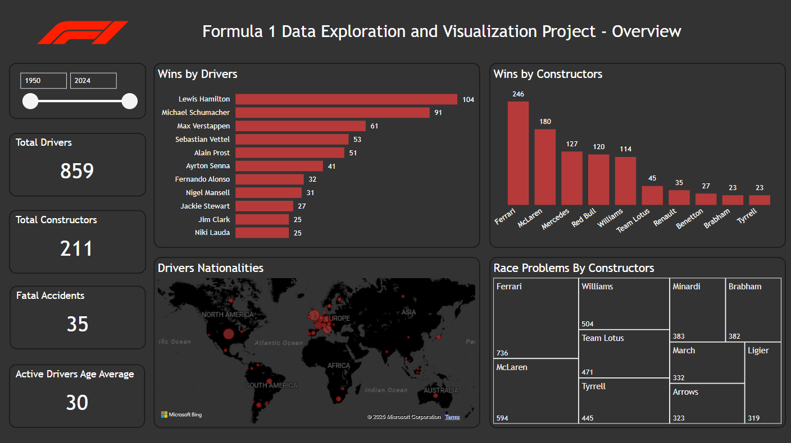
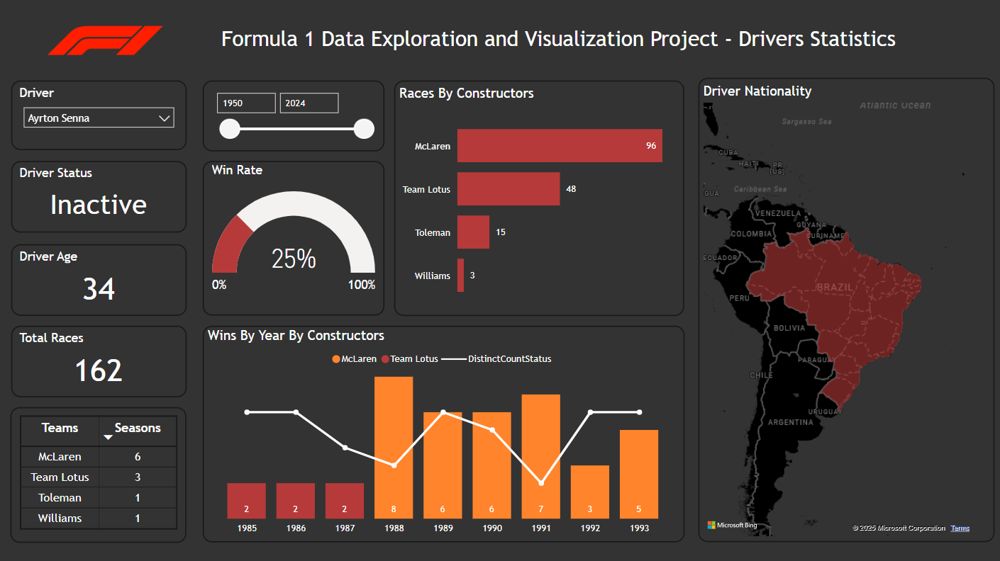
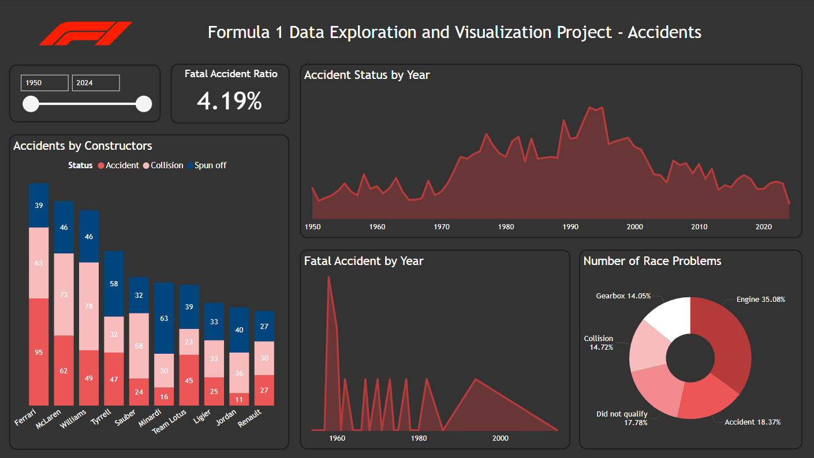

# Formula 1 Data  Exploration and Visualization

## Introduction

While watching *Senna* on Netflix and seeing his fight against FIA's 1994 ban on performance-enhancing technology (the same year of his tragic accident), I started wondering about Formula 1 data. How many accidents happened after the new regulations? What exactly was banned? How many drivers have lost their lives in F1 history? And, of course, who are the best drivers and teams?

With these questions in mind, I turned to Kaggle and found the [Formula 1 Dataset](https://www.kaggle.com/datasets/rohanrao/formula-1-world-championship-1950-2020), containing data from 1950 to 2020. It was the perfect starting point for this project.

## Project Goals and Skills Applied

The main goal was to clean, analyze, and explore Formula 1 data to answer these questions and uncover new insights. Along the way, I applied and improved several skills, including:

- **Web Scraping** to get additional data on driver fatalities
- **Advanced Data Analysis with Pandas** for data manipulation
- **Data Cleaning and Type Conversion** to ensure consistency
- **DAX (Data Analysis Expressions)** for calculations in Power BI
- **Data Visualization with Power BI** to create meaningful insights

## Data Exploration

The first step was to analyze the structure of each CSV file and merge them into a single DataFrame, making the data easier to work with in Python and Power BI.

  ```python
  merge1 = pd.merge(df_results, df_races, on='raceId')
  merge2 = pd.merge(merge1, df_drivers, on ='driverId')
  merge3 = pd.merge(merge2, df_constructors, on = 'constructorId')
  df_complete = pd.merge(merge3, df_status, on = 'statusId')
  ```

After merging the datasets, I handled missing values, performed statistical analysis, and removed or renamed unnecessary columns to streamline the data.

  ```python
  df_complete.isnull().sum()
  df_complete.info()
  
  df_complete = df_complete.drop(columns=['url', 'url_x', 'url_y', 'fastestLapTime', 'time_y', 'fp1_date', 'round', 'circuitId',
                                          'fp1_time', 'fp2_date', 'fp2_time', 'fp3_date', 'fp3_time', 'quali_date', 'quali_time',
                                          'sprint_date', 'sprint_time'])
  
  col_name = {'number_x':'number','milliseconds':'timetaken_in_millisec', 'time_x': 'time', 'name_x': 'GrandPrixName',
              'number_y':'driverNum','code':'driverCode','nationality_x':'driverNationality','name_y':'constructorName',
              'nationality_y': 'constructorNationality', 'name': 'constructorName', 'fastestLapSpeed': 'maxSpeed'}
  
  ```

#### Data Cleaning and Transformation

- Converted data types to enable accurate calculations, such as driver ages

  ```python
  df_complete['dob'] = df_complete['dob'].str.strip()
  df_complete['dob'] = pd.to_datetime(df_complete['dob'], dayfirst=True, errors='coerce')
  
  ## Handling Null values and unformatted date to convert it to datetime
  df_complete['driverDeath'] = df_complete['driverDeath'].str.strip()
  df_complete['driverDeath'] = df_complete['driverDeath'].replace('\\N', np.nan)
  df_complete['driverDeath'] = pd.to_datetime(df_complete['driverDeath'], errors='coerce', dayfirst=True)
  ```

- Addressed inaccuracies in age calculations by incorporating a new column containing the date of death drivers using web scraping (**drivers_update.ipynb**)
  
- Managed missing numerical values to maintain data integrity
  
  ```python
  ## Changing the numeric data type
  change_data_type = ['number', 'position', 'time', 'timetaken_in_millisec', 'fastestLap', 'rank', 'maxSpeed']
  for i in change_data_type:
      df_complete[i] = pd.to_numeric(df_complete[i], errors='coerce')
  ```

- Enhanced geographic data by mapping driver nationalities to their respective countries, allowing for effective visual representation on Power BI maps

  ```python
  nationality_map = dict(zip(df_countries['Nationality'], df_countries['Country']))
  df_complete['driverNationality'] = df_complete['driverNationality'].map(nationality_map).fillna(df_complete['driverNationality'])
  df_complete.head()
  ```

To achieve one of my key goals—identifying drivers who died while racing—I used web scraping to extract relevant data from Wikipedia and integrated it into the dataset (**wsFatalities.ipynb**).

After finalizing the dataset, I exported it as a single, clean CSV file: **F1Dataset.csv**.

## Dashboard Development

Using **Power BI**, I imported the cleaned dataset to visualize and further analyze the data. This led to the creation of an interactive dashboard that highlights key insights. The dashboard can be accessed [here](https://app.powerbi.com/view?r=eyJrIjoiZTg2MGM5MjItOTkzMy00NmE1LTg5MWQtMTM0ZjAxMGRlMmEwIiwidCI6ImI4ZGM5MmQ2LTk3YjktNDcxYS05OTRhLWY3YmY2ZjgwMjllZSJ9).







## Key Insights and Findings

By analyzing the data using Python and Power BI, I found some interesting insighs:

- **Average Age of Active Drivers:** 30 years
- **Driver Location:** Most drivers are based in Europe
- **Accidents vs. Victories:** No clear correlation between a constructor's number of accidents and their victories
- **Fatal Accident Ratio:** 4.19%, which is relatively low considering the high-risk nature of the sport.
- **Engine failures:** turned out to be the most common reason for race retirements.

### Impact of FIA's 1994 Regulation Changes

Looking deeper into FIA’s 1994 regulations, I found that banning electronic driver aids (like launch control, active suspension, traction control, and ABS) made a huge impact.

From **1986 to 1993**, there were no fatal accidents. Then in **1994**, two drivers (includding Senna) died, pushing the **fatality rate to 6.52%**. 

That year also saw a rise in incidents like spinning off, collisions, and accidents. After 1994, FIA put a major focus on safety, and as the data shows, there were almost **20 years without a single fatal accident**.

## Conclusion

There’s still a lot more to uncover in this dataset, from detailed driver stats to constructor performance. If you're curious, you can check out the dataset [here](https://app.powerbi.com/view?r=eyJrIjoiZTg2MGM5MjItOTkzMy00NmE1LTg5MWQtMTM0ZjAxMGRlMmEwIiwidCI6ImI4ZGM5MmQ2LTk3YjktNDcxYS05OTRhLWY3YmY2ZjgwMjllZSJ9).

This project gave me the chance to apply a mix of Python and Power BI skills to explore one of my favorite sports, and I’m excited to keep digging into more insights in the future.
